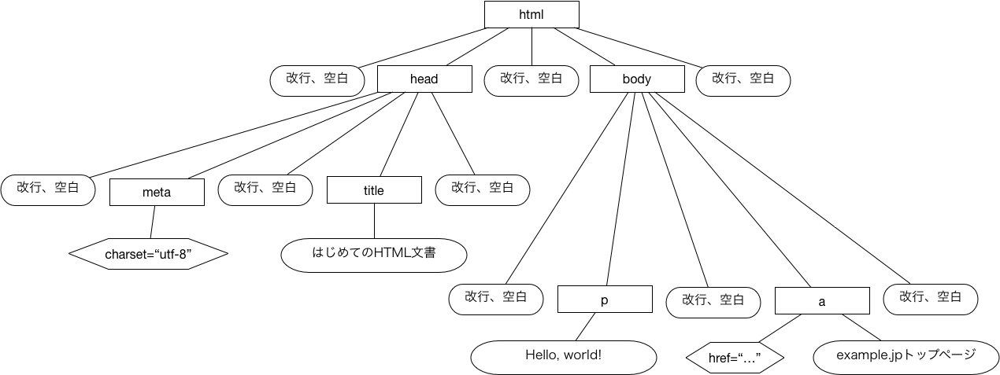

# HTML

- HTML（Hypertext Markup Language）:Webページを記述するための書式（マークアップ言語）
  - マークアップ言語はプログラミング言語ではない
  - プレインテキストに、**タグ**と呼ばれる特別な記号を埋め込み、テキストの各部分の意味を明確にする

### HTMLの歴史、位置付け

[神崎正英氏による日本語でよくまとめられたページがある](http://www.kanzaki.com/docs/html/htminfo-ex1.html)ので、詳しくはこのページを参照されたい。

CERNでWebが開発された当初から、Webページの記述方式としてHTMLが考案され、使用されていた。これを基に、1995年にIETFによってHTML 2.0が([RFC1866](http://www.ietf.org/rfc/rfc1866.txt))公開され、その後W3C(World Wide Web Consortium)によって1997年1月に[HTML 3.2](http://www.w3.org/TR/REC-html32)が、1997年8月に[HTML 4.0](http://www.w3.org/TR/REC-html40)が、1999年12月に[HTML 4.01](http://www.w3.org/TR/html401)が、2000年1月に[XHTML 1.0](http://www.w3.org/TR/xhtml1)(2002年8月に改訂）が、それぞれ国際標準（勧告）として公開されている。

ここまでのHTMLは、SGML(Standard Generalized Markup Language)やXML(Extensible Markup Language)という汎用マークアップ言語に基づいて定義されていた。しかし、Webをアプリケーション基盤として使用するニーズが増大する中で、HTMLも、Webブラウザで用いるデータ構造として再定義するという流れが強まり、この方向で、SGMLやXMLには基づかない新たなマークアップ言語として、2014年10月に[HTML 5](http://www.w3.org/TR/html5/)が、2016年11月に[HTML 5.1](https://www.w3.org/TR/html51/)がそれぞれW3Cの勧告として公開されている。

本稿で用いる例は原則としてHTML 5の文法に基づいている。ただし、読者の理解を助けるため、HTML 5のW3C勧告とは異なり、構文から意味へと説明を進めている。

### HTMLの構文

HTML5で書かれたテキスト（HTML文書という）の例を次に示す。

``` html
<!DOCTYPE html>
<html>
<head>
  <meta charset="utf-8">
  <title>はじめてのHTML文書</title>
</head>
<body>
  <p>Hello world!</p>
  <a href="http://example.jp/index.html">example.jpトップページ</a>
</body>
</html>
```

この例では、`<html>`, `<head>`, `<meta>`, `<title>`, `</title>`, `</head>`, `<body>`, `<p>`, `</p>`, `<a>`, `</a>`, `</body>`, `</html>`などのタグが使われている。このうち、`<html>`, `<title>`のように先頭から2文字目が`/`でないものを**開始タグ**, `</html>`, `</title>`のように先頭から2文字目が`/`であるものを**終了タグ**という。

原則として開始タグと終了タグは対にして用いる。対になっている開始タグから終了タグまでを**通常要素**(normal element)という[^1]。上の例でいうと `<html>〜</html>`, `<head>〜</head>`, `<title>はじめてのHTML文書</title>`などは全て通常要素である（他にもある）。開始タグと終了タグに囲まれた部分を**内容**(content)という。なお、通常要素の中には開始タグや終了タグを省略しても構わない、とされているものもある。

[^1]: HTMLの仕様書では、通常要素は内容に関する制限、タグの由来などによってさらにいくつかの種類に細分化されている。ここでは簡単のため、開始タグと終了タグからなる要素を全て通常要素と呼んでいる。

開始タグだけが単独で使われる場合もある。上の例でいうと `<meta charset="utf-8">`がこれに該当する。これを**空要素**(void element)という。空要素は、終了タグの省略された通常要素と見かけは似ているが、内容を持たない点が大きく異なっている。

通常要素と空要素を合わせて**要素**(element)という。要素は多くの場合、文書中でのある意味を持った部分を指し示したり、文書の性質を表現したりしている。例えば上の例では:

* `<title>はじめてのHTML文書</title>`は文書のタイトルを表す
* `<p>Hello world!</p>`は段落を表す
* `<body>〜</body>`はブラウザで表示される部分を表す
* `<meta charset="utf-8">`は、この文書の文字コードが`utf-8`であることを表す

上の例の通り、HTML文書には、通常要素である`html`要素が1つだけ、必ず置かれる。そして、通常要素は、その内容に別の要素を複数個含んでも良い。結果として、HTML文書は`html`要素を根とし、要素を節点とする木を表現している。

要素の中には、その要素の性質や振る舞いを制御する項目を開始タグの内側に記述しているものがある。上の例では`<a href="http://example.jp/index.html">example.jpトップページ</a>`が該当する。この`href=""`の部分を**属性**といい、`=`の前を**属性名**、後ろを**属性値**という。これは`a`要素（アンカー、目印を表す要素）に`href`属性を加えることでリンクを表現している。属性値は必ず一重引用符`'`か二重引用符`"`で囲まなければならない。なお、属性によっては属性名しか記述しないものもある。(例: `<dl compact>`)

HTML文書の1行目には必ず、`<!DOCTYPE html>`という記述を置く必要がある。これはもともとSGMLやXMLにおける文書型宣言(Document Type Declaration)に由来する記法であるが、Webブラウザの実装として、この記述が1行目にないと古いHTMLで書かれた文書だと解釈して、文書の整形等でレガシーな振る舞いをする場合がある。そのため、HTMLがSGMLやXMLとは関係なくなった現在でも、この記述を文書の先頭に置く必要が残っている。

### HTMLの例と振る舞い

Webアプリケーションの視点から重要なHTMLコードとその振る舞いについて述べる。

#### a要素

以下のように`a`要素を用いるとリンクを表す。

``` html
<a href="http://example.jp/index.html">example.jpトップページ</a>
```

`a`要素の内容である「example.jpトップページ」の箇所がリンクになり、ここをクリックすると`href`属性に示されているURI `http://example.jp/index.html`に`GET`メソッドが発行される。

```
GET /index.html HTTP/1.1
Host: example.jp

```

#### form要素

`form`要素はHTMLフォームを表す。例として、`http://example.jp/login`に次のHTMLコードが含まれていたとする。

``` html
<form action="/profile" method="POST">
  userid: <input type="text" name="userid" id="userid"><br>
  password: <input type="password" name="password" id="password"><br>
  <input type="submit" value="login">
</form>
```

`http://example.jp/login`をブラウザで表示すると、次のような入力フォームになる。`form`要素の子要素である3つの`input`要素がそれぞれ1つ目の入力フォーム（`userid`フィールド）、2つ目の入力フォーム（`password`フィールド）、`login`ボタンに対応している。


`userid`フィールドに`taro`、`password`フィールドに`aD1eibah`と入力して`login`ボタンをクリックすると、`action`属性のURL`/profile`（ここにはパスしか書かれていない。ページのURIからパスを除いた `http://example.jp` にパス `/profile` を加えた `http://example.jp/profile` が完全なURIになる）に`POST`メソッド（`form`要素の`method`属性の値）が発行される。その際、フィールドの名前と値が`POST`パラメータとしてリクエストメッセージに含まれる。

```
POST /profile HTTP/1.1
Host: example.jp
Content-Type: application/x-www-form-urlencoded

userid=taro&password=aD1eibah
```

なお、`password`フィールドを表す`input`要素は`type`属性が`password`と指定されており、通常ブラウザでは、入力内容は`*`などに置き換えて表示される。しかし、上のリクエストメッセージを見ると分かるように、通信されるデータには`password`フィールドの値がそのまま埋め込まれており、通信内容を盗聴されるとパスワードが第三者に知られてしまう。したがって、このように秘匿すべき情報を送信するときは、通信路の暗号化などの対策が必須となる。

`form`要素の`method`属性には、歴史的経緯により、`GET`と`POST`しか指定できない。つまり、通常、ブラウザからは`GET`メソッドと`POST`メソッドしか発行することができないのである。`form`要素の`method`属性に`GET`を指定した例を次に示す。

``` html
<form action="/search" method="GET">
  キーワード: <input type="text" name="keyword" id="keyword"><br>
  <input type="submit" value="search">
</form>
```

この`form`要素の1つ目の`input`要素（`keyword`フィールド）に`programming`と入力し、2つ目の`input`要素（`search`ボタン）をクリックすると、次のように、`keyword`フィールドの値が`GET`パラメータとしてURIに埋め込まれ、HTTPリクエストが発行される。

```
GET /search?keyword=programming HTTP/1.1
Host: example.jp
　
```

### HTMLの意味

前述したように、HTML文書には`html`要素だけがただ1つ含まれ、かつ、通常要素の内容には要素が複数含まれることがある。これらのことから、HTML文書は`html`要素を根とし、要素を節点とするような木と考えることができる。

この事実を基に、HTML文書を表すデータ構造として規格化されたのが**DOM（Document Object Model）**である。DOMでは要素だけでなく、テキスト（空白・改行を含む）、属性なども節点として扱われる。本章の最初に述べたHTML文書の例に対応するDOMは次のようになる。この図では、長方形の節点が要素を、丸角長方形がテキストを、六角形が属性をそれぞれ表している。


ブラウザがHTML文書を読み込むと、構文解析を行い、結果をDOMの形で内部データ構造として保持する。そしてこのDOMを基に表示（**レンダリング**）を行う。重要なのはDOMと表示結果が常に対応づけられている点で、ブラウザ内部でDOMを更新すると、それに合わせて表示が更新される。

### モバイル端末とHTML

PCに比べ、モバイル端末には様々なハードウェア上の制約がある。HTMLに関してとりわけ影響が大きいのがディスプレイのサイズである。そこで、モバイル端末でもPCと同等の読みやすさを実現するため、様々な技術が開発されてきた。その中で、現在は**レスポンシブウェブデザイン**と呼ばれる手法が主流になっている。以下、Googleが開発者向けに公開している[レスポンシブウェブデザインの基礎](https://developers.google.com/web/fundamentals/design-and-ui/responsive/?hl=ja)という文書を元に、モバイル端末とHTMLの関係について簡単に述べる。

モバイル端末のディスプレイサイズは極めて多様であり、Webページ作成者側がすべてのディスプレイサイズに合わせてページレイアウトを指定するのは不可能である。そこで、レスポンシブウェブデザインでは、次のような方針でページレイアウトを設計する。

1. Webページを、モバイル端末のディスプレイサイズの横幅を基にレンダリングする
2. CSS(Cascading Style Sheet)のメディアクエリ機能を使ってディスプレイサイズの横幅をグループ化し、グループごとにページレイアウトを指定する

まず、以下の指定をHTMLページに埋め込み、ブラウザに、当該HTMLページをモバイル端末のディスプレイサイズの横幅を基にレンダリングするよう指定する。

``` html
<meta name="viewport" content="width=device-width, initial-scale=1.0">
```

`content`属性のうち`width=device-width`でページの横幅(`width`)をディスプレイサイズの横幅(`device-width`)に指定しており、さらに`initial-scale=1.0`でスケーリング処理を初期状態では行わないよう指定している。

次にCSSによるページレイアウト指定について述べる。CSSはHTMLの要素にどのような装飾を加えるか（要素をどのように表示するか）を指定するための言語であり、現代のWebサイトデザインでは必須の基礎技術である（本稿では詳細は省略する）。

CSSのメディアクエリを使った例を以下に示す。この例で`@media ...`という部分が**メディアクエリ**と呼ばれ、CSSによる装飾指定のフィルタリング条件になっている。この例ではディスプレイサイズの横幅が360ピクセル以上だった場合(`min-width: 360px`)に、`body`要素内でのフォントサイズを1.0emにする(`font-size: 1.0em`)よう指定している。通常レスポンシブウェブデザインでは、このようにディスプレイサイズの横幅をいくつかのグループに分け、グループごとに装飾を別指定する。

``` css
@media (min-width: 360px) {
  body {
    font-size: 1.0em;
  }
}
```


