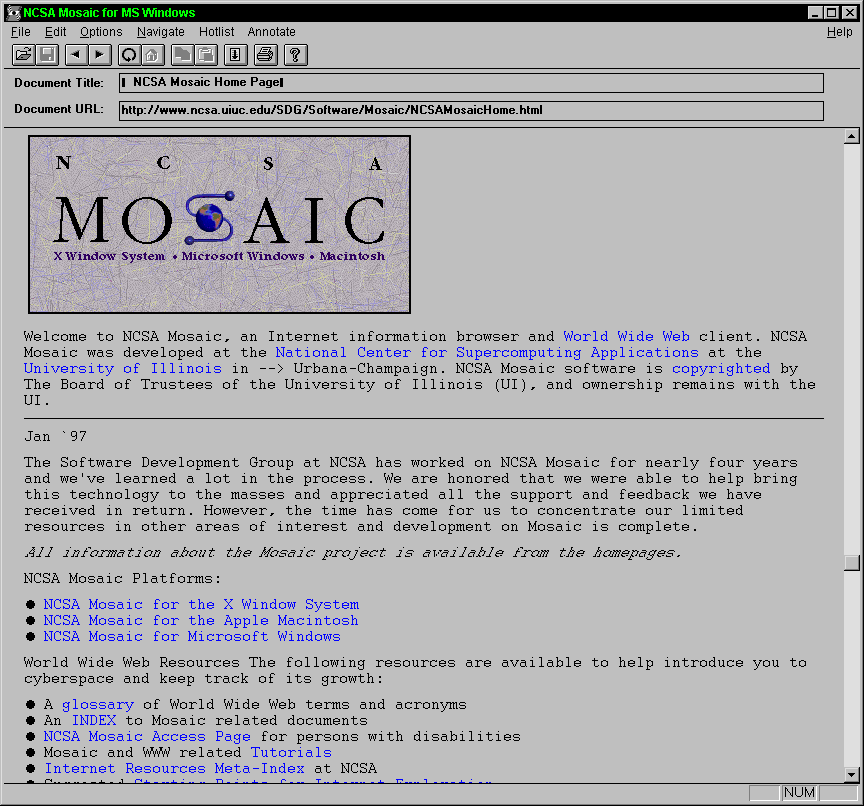

## 歴史

Webの原型は、1965年にTed Nelsonによって提案されたハイパーテキスト（HyperText）という概念に遡ることができる。複数のテキスト文書をリンクで結びつけたデータ構造と、それを編集・閲覧するシステムであり、実装も行われた。また、この概念は後にApple社によりHyperCardというソフトウェアとして実現され、広く使われるようになった。ただし、これらは単一コンピュータ上にデータとシステムが集約されていることが前提であった。

1990年、欧州原子核共同研究機構（Conseil Européan pour la Recherche Nucléaire, CERN）のTim Berners-Leeが開発。目的は、各国の科学者間で情報を共有する手段であった。ここで、ハイパーテキストを分散ネットワークシステム上で実現する、というWebの基本的な概念が実現された。

([http://commons.wikimedia.org/wiki/File%3AWorldWideWeb.1.png](http://commons.wikimedia.org/wiki/File%3AWorldWideWeb.1.png))

1993年、イリノイ大学米国立スーパーコンピュータ応用研究所（National Center for Supercomputing Application, NCSA）がブラウザMosaicを公開。本文中に画像を混在させることが可能で、現在のブラウザの原型である。

(NCSA/University of Illinois, [http://www.ncsa.illinois.edu/news/press](http://www.ncsa.illinois.edu/news/press))